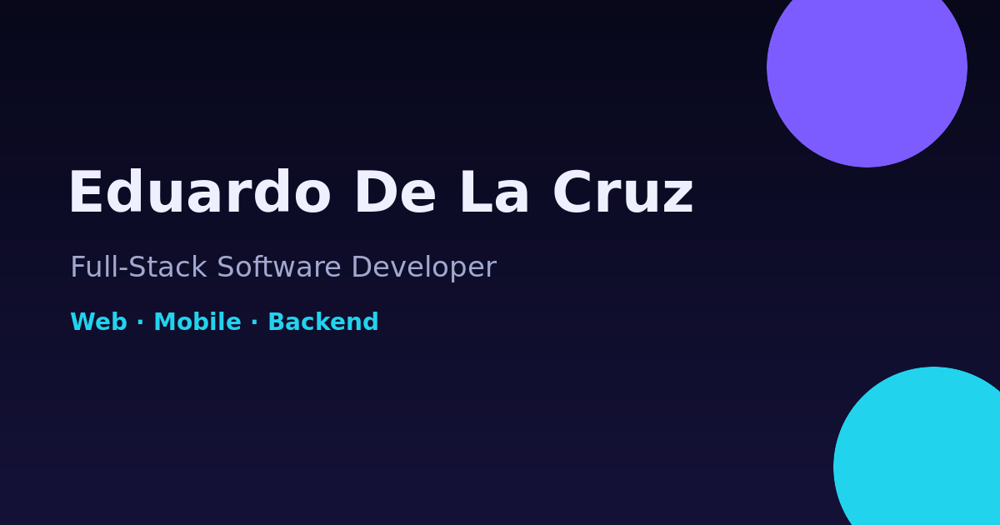

<div align="center">
  

# Eduardo De La Cruz — Developer Portfolio

**Full-Stack · Web · Mobile · Business Software**

A personal developer portfolio built with React, TypeScript, Vite and Three.js, focused on presenting my work, skills and experience through an interactive and responsive interface.

[](https://portfolio-one-blue-anckqnppbh.vercel.app/)
[](https://github.com/eduardolluis)
[](https://www.linkedin.com/in/eduardo-de-la-cruz-b6171837a/)

</div>

<p align="center">
  
</p>

## About

This repository contains my personal developer portfolio. The site is designed to showcase my background as a Software Engineering student and my work across full-stack web development, mobile applications and business software.

The interface combines a dark visual system with an interactive WebGL experience, responsive layouts, bilingual content and project galleries.

## Highlights

- Interactive **Three.js / WebGL morphing hero**
- React + TypeScript + Vite architecture
- Fully responsive desktop and mobile experience
- English / Spanish interface
- Interactive project modals and galleries
- Keyboard and swipe navigation
- Downloadable resume
- Contact form with email fallback
- SEO metadata, Open Graph, sitemap and robots configuration
- Accessibility support including reduced motion and visible focus states
- Optimized mobile rendering for the 3D background

## Tech stack


### Technologies represented in my work

**Frontend:** React, Next.js, TypeScript, JavaScript, HTML, CSS, Tailwind, Vite  
**Mobile:** Flutter, Dart, Riverpod  
**Backend:** FastAPI, Node.js, Express, REST APIs, SQLAlchemy  
**Data & services:** PostgreSQL, MySQL, MongoDB, Supabase, Firebase, Appwrite  
**Realtime & media:** Socket.IO, LiveKit, Agora, Cloudinary  
**Tools:** Git, GitHub, GitHub Actions, Docker, Linux, Bash, Vercel, Render  
**Other languages:** Python, C#, C++

## Project structure

```text
portfolio/
├── api/                    # Contact endpoint
├── public/
│   ├── images/             # Portfolio assets
│   ├── favicon.svg
│   ├── og-image.png
│   ├── sitemap.xml
│   ├── robots.txt
│   └── Eduardo_De_La_Cruz_Resume.pdf
├── src/
│   ├── components/         # UI and interactive components
│   ├── data/               # Portfolio content
│   ├── App.tsx
│   ├── main.tsx
│   └── styles.css
├── tests/
├── scripts/
├── package.json
└── vite.config.ts
```

## Run locally

```bash
npm install
npm run dev
```

For a production build:

```bash
npm run build
npm run preview
```

## Available scripts

```bash
npm run dev       # Start Vite development server
npm run build     # TypeScript + production Vite build
npm run preview   # Preview the production build locally
npm run lint      # Run ESLint
npm test          # Run portfolio tests
npm run check     # Tests + lint + production build
```

## Deployment

The portfolio is deployed on Vercel:

**https://portfolio-one-blue-anckqnppbh.vercel.app/**

## Resume

My resume is available directly from the portfolio and inside this repository:

[View resume](./public/Eduardo_De_La_Cruz_Resume.pdf)

## Contact

**Eduardo De La Cruz**  
Software Engineering Student · Full-Stack / Mobile Developer  
Santo Domingo, Dominican Republic

- Email: [eduardodelacruzg5@gmail.com](mailto:eduardodelacruzg5@gmail.com)
- GitHub: [@eduardolluis](https://github.com/eduardolluis)
- LinkedIn: [Eduardo De La Cruz](https://www.linkedin.com/in/eduardo-de-la-cruz-b6171837a/)
- Portfolio: [portfolio-one-blue-anckqnppbh.vercel.app](https://portfolio-one-blue-anckqnppbh.vercel.app/)

---

<div align="center">
  Built by <strong>Eduardo De La Cruz</strong>.
</div>
